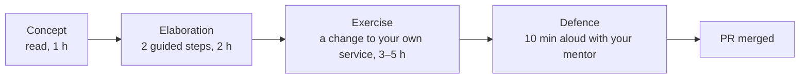

# The AI Engineering track

<!-- Rendered on the hub page in three parts: "The track", "How a week works", "Sessions and gates".
     Keep the three level-2 headings below exactly as they are; the page splits on them. -->

## The track

You are preparing for Track 3 of the Entry-Level AI Skills framework, *AI Engineering*: you build a
product whose main feature is a model somebody else trained. Switch the model off and the product
stops working. Six weeks, eleven areas, one repository that grows week by week into something you
can deploy, measure and defend in an interview.

| # | Cluster | Area | Week |
| --- | --- | --- | --- |
| 1 | Foundations | Software foundations for AI work | 0 (assessed, not taught) |
| 2 | Foundations | Working with a model as a component | 1 |
| 3 | Foundations | Context engineering | 2 |
| 4 | Retrieval and agents | Retrieval, done properly | 2 |
| 5 | Retrieval and agents | Grounding and honest answers | 3 |
| 6 | Retrieval and agents | Agents and tools | 4 |
| 7 | Retrieval and agents | Connecting to real systems (MCP) | 4 |
| 8 | Trust and shipping | Evaluation | 3 |
| 9 | Trust and shipping | Observability and cost | 5 |
| 10 | Trust and shipping | Security and guardrails | 5 |
| 11 | Trust and shipping | Shipping and proving it | 6 |

The two areas that decide most hiring outcomes are Retrieval (Week 2) and Evaluation (Week 3).
They get the most hours.

## How a week works

Every week has the same four steps, and you never scaffold a new project after Week 0.

- **Concept**: one page, one sentence you must be able to say back in your own words, a few
  diagrams and a short reading list.
- **Elaboration**: run one or two small scripts and read a few files. Change nothing yet.
- **Exercise**: build the one piece that week leaves out (it ships as a stub with the build order
  in comments), then measure something with the week's script.
- **Defence**: a 30–40 minute session where your mentor probes your pull request and runs a few
  inputs you have not seen. Then the next week's sentence.

Your **route** (start, core or pro) is set by your mentor after Week 0. The exercises are the same
on every route; what changes is how much is given to you, which extra checks run, and where your
mentor's hours go. Set it once with `make route ROUTE=...`.

## Sessions and gates

Three layers of evidence, from cheapest to most human. None of them is self-reported.

| Layer | Who | What it measures |
| --- | --- | --- |
| **The gate**: `make check WEEK=N` | CI, on every pull request, with a fake model so no key is needed | Lint, strict types, that week's tests under two fake providers, and from Week 3 the evaluation gate, from Week 5 the attack gate |
| **Held-out inputs** | Your mentor, in the session | How your service behaves on documents and questions you did not design for |
| **Your reflection**: `reflections/week-N.md` | You write, your mentor reads | The concept in your words, what surprised you, what you would change. This is what the session is about |

The session itself, every week:

| Minute | What happens |
| --- | --- |
| before | Your mentor reads the CI result and your reflection |
| 0–8 | You demo the running thing |
| 8–28 | Your mentor probes the diff, typing questions as review comments on the PR |
| 28–35 | Held-out inputs |
| 35–40 | Next week's sentence; you say it back |

Understanding shown in the session caps the outcome; nothing adds to it. The self-tests on this
page are yours alone: their score never leaves your browser.
