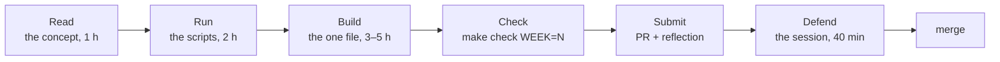

# The AI Engineering track

<!-- Rendered on the hub page in three parts: "The track", "How a week works", "Sessions and gates".
     Keep the three level-2 headings below exactly as they are; the page splits on them. -->

## The track

You are preparing for Track 3 of the Entry-Level AI Skills framework, *AI Engineering*: you build a
product whose main feature is a model somebody else trained. Switch the model off and the product
stops working. Six weeks, eleven areas, one repository that grows week by week into something you
can deploy, measure and defend in an interview.

| # | Cluster | Area | Week |
| --- | --- | --- | --- |
| 1 | Foundations | Software foundations for AI work | 0 (assessed, not taught) |
| 2 | Foundations | Working with a model as a component | 1 |
| 3 | Foundations | Context engineering | 2 |
| 4 | Retrieval and agents | Retrieval, done properly | 2 |
| 5 | Retrieval and agents | Grounding and honest answers | 3 |
| 6 | Retrieval and agents | Agents and tools | 4 |
| 7 | Retrieval and agents | Connecting to real systems (MCP) | 4 |
| 8 | Trust and shipping | Evaluation | 3 |
| 9 | Trust and shipping | Observability and cost | 5 |
| 10 | Trust and shipping | Security and guardrails | 5 |
| 11 | Trust and shipping | Shipping and proving it | 6 |

The two areas that decide most hiring outcomes are Retrieval (Week 2) and Evaluation (Week 3).
They get the most hours.

## How a week works

Every week is the same loop, in six words you will see everywhere: **Read, Run, Build, Check,
Submit, Defend**. You never scaffold a new project after Week 0.

- **Read**: one page, one sentence you must be able to say back in your own words, a few
  diagrams and a short reading list. Write the sentence in `reflections/week-N.md`, Q1.
- **Run**: one or two small scripts and a few files to read. Change nothing yet.
- **Build**: the one piece that week leaves out ships as a stub with the build order in comments.
  Build it, then measure something with the week's script.
- **Check**: `make check WEEK=N`, as often as you like. Green is the goal, not the end.
- **Submit**: a pull request from branch `week-N` to `main`, and your reflection, 24 hours before
  the session.
- **Defend**: a 30–40 minute session where your mentor probes your pull request and runs inputs
  you have not seen. Then the next week's sentence.

Your **route** (start, core or pro) is set by your mentor at discovery from two questions, in
order: can you do the basic work of the track at all; and do you check what you produce. It holds
for the programme, with one correction point at session 2. The route changes what you are given,
never what is measured:

| | start | core | pro |
| --- | --- | --- | --- |
| Exercises | faults named, a worked example given (`weeks/N/routes/worked_example.py`) | faults present, not located, count not given: each exercise file is complete with mistakes planted | no helpers, one real constraint added (`weeks/N/routes/pro.md`) |
| Pace | slow, mentor-supported | compressed | self-directed |
| Finished piece | modest and completed | full | harder, made public |

Set it once with `make route ROUTE=...`; each week's `routes/<route>.md` says what that means for
the week.

## Sessions and gates

Mentor time is four sessions, and nothing else except up to two fifteen-minute unblock calls.
That is the framework's rule, and it is what makes the route matter: the sessions are where the
hours go, so what they are spent on depends on where you started.

| Session | When | Length | What happens |
| --- | --- | --- | --- |
| **1. Discovery** | Week 0 | 45 min | An observed task sets your route and takes the starting measure. The finished piece is agreed |
| **2. Direction** | end of Week 1 | 45 min | Route confirmed or corrected, in writing. The plan for the rest is set against the work you already attempted |
| **3. Observation** | end of Week 3 | 60 min | Your mentor watches you work on a task you have not seen. Not a progress report: they see how you think, check and recover |
| **4. Defence** | end of Week 6 | 60 min | You defend the finished piece. The starting measure is taken again |

Weeks 2, 4 and 5 are self-directed: the gate, the held-out inputs your mentor left with you, the
self-tests and this page are your feedback. Your pull requests still go up every week; your mentor
reads them before the next session, and their review comments land in that session, not between.

**Unblock calls**: up to two, fifteen minutes each, on request, after you have attempted the thing
yourself. Send what you tried with the request.

**Where the hours go**, by route:

| Route | Sessions 2 and 3 concentrate on | Pace |
| --- | --- | --- |
| start | the basics: Weeks 1–2, getting the model layer and retrieval working at all | slow, mentor-supported; use both unblock calls early |
| core | quality: Weeks 3–5, checking what you produce: evaluation, guardrails, traces | compressed |
| pro | evidence: Week 6, the deployed piece, the write-up, the defence | self-directed |

Three layers of evidence, from cheapest to most human. None of them is self-reported.

| Layer | Who | What it measures |
| --- | --- | --- |
| **The gate**: `make check WEEK=N` | CI, on every pull request, with a fake model so no key is needed | Lint, strict types, that week's tests under two fake providers, and from Week 3 the evaluation gate, from Week 5 the attack gate |
| **Held-out inputs** | Your mentor, in sessions 2 and 3, and left with you for the self-directed weeks | How your service behaves on documents and questions you did not design for |
| **Your reflection**: `reflections/week-N.md` | You write, your mentor reads before each session | The concept in your words, what surprised you, what you would change |

Work reaches your mentor a day early, so the session is not spent finding out what is there. You
talk more than your mentor, because otherwise the hour drifts into them solving the problem.

Understanding sets a ceiling: at the Defence your mentor judges whether you can explain your own
work, and that judgement caps what the programme records; it never adds to it. You are always
shown what you produced and what it missed. You are never shown the measure that goes to the
programme, and neither is this page. The self-tests here are yours alone.
