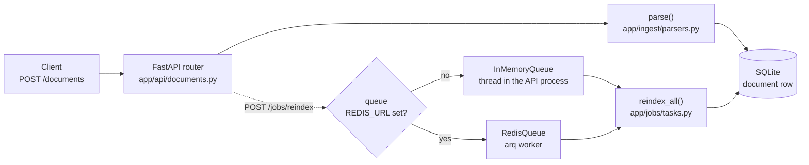

# Week 0 — Foundations gate

Area 1 of the track is not taught here. It is checked. This week you show that the ground the
next six weeks stand on is solid, and your mentor uses what they see to place you on a route.

**There is no model anywhere in the service yet.** That is deliberate.

## What the service does today

| Endpoint | Purpose |
| --- | --- |
| `POST /documents` | Upload a `.pdf`, `.csv`, `.md` or `.txt`; it is parsed to text and stored in SQLite |
| `GET /documents/{id}` | The text and metadata back |
| `GET /documents` | List |
| `POST /jobs/reindex` | Start a slow batch job on a queue and return at once |
| `GET /jobs/{id}` | Its status |
| `GET /health` | Liveness |

One upload, drawn. Trace it in the code, then trace it aloud.




## Do this (about 2 hours)

1. `make check WEEK=0` — read the output. Everything should be green.
2. `make run` — open the forwarded port, go to `/docs`, upload `samples/invoice.md`, read it back.
3. Start a reindex job, then immediately call `/health`. Notice the API did not wait.
4. Read, in this order, and be ready to explain each one in two sentences:
   - `app/main.py` → `app/api/documents.py` → `app/ingest/parsers.py` → `app/db/session.py`
   - `app/jobs/queue.py` — why are there two queues, and which one is running right now?
5. Build the production image and run it:
   ```
   docker build -t ai-eng-track .
   docker run -p 7860:7860 ai-eng-track
   ```
   Then `curl localhost:7860/health`.
6. Fill `reflections/week-0.md` (copy `REFLECTION_TEMPLATE.md` there), Q1 only: trace one upload request from
   the HTTP call to the row in SQLite, in your own words, under 150 words.

## The discovery session

Your mentor will ask you to trace one request aloud, unaided, in under three minutes, and will
ask one or two of the questions above. Nothing else. There is no pass or fail; there is a route.

## Then

`make route ROUTE=<what your mentor said>` once. Then open `weeks/1/CONCEPT.md`.

## Read more

Checked September 2026. Two pages, one video; the rest of the week is doing, not reading.

- [The Twelve-Factor App: config](https://12factor.net/config) — why every setting in this repo lives in `.env` and nothing in code. Five minutes.
- [FastAPI: middleware](https://fastapi.tiangolo.com/tutorial/middleware/) — how a request travels through the service; Week 5 adds a tracer exactly here.
- [Andrej Karpathy, Intro to Large Language Models](https://www.youtube.com/watch?v=zjkBMFhNj_g) (video, 1 h) — the model you are about to treat as a dependency, from the inside. Watch before Week 1 if you have never looked under the hood.

## Optional: self-test

`QUIZ.md` in this folder has a few questions on this week's concept, each with an explanation. On the hub page they are interactive and scored, but the score lives only in your browser: it never reaches the repo, your mentor or your route. Use it to find what to re-read.
