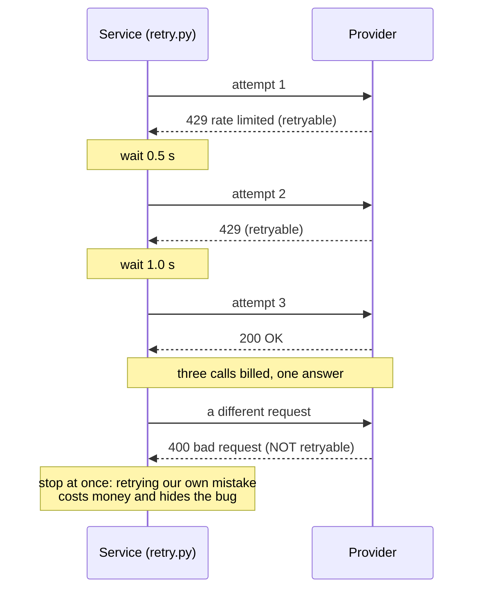
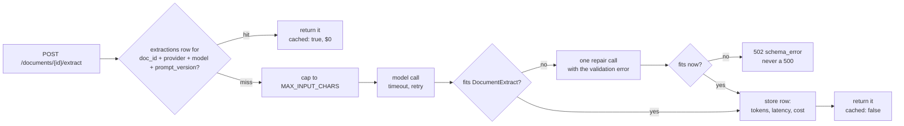
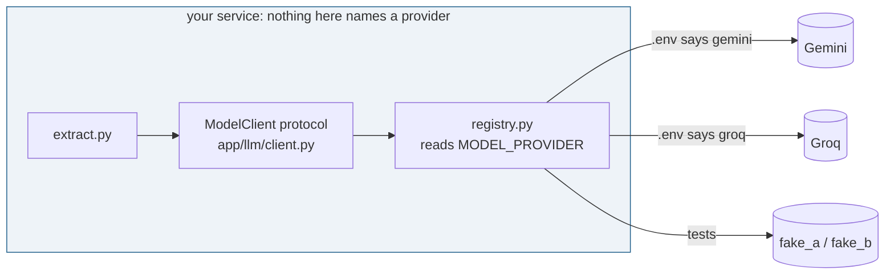

# Week 1 — Concept

> **A model is an unreliable, expensive, non-deterministic third-party dependency. Treat it like one.**

Read this once (about 20 minutes). Then write the sentence above in your own words in
`reflections/week-1.md`, Q1, before you touch any code.

## Five ways a model betrays you

Everything in this week's exercise exists because of one of these.

**1. It fails.** Rate limits (HTTP 429), outages (5xx), network drops. Some failures pass if you
try again in a second. Some (a 400: you sent something wrong) never will, and retrying them burns
money and hides your bug. A good client knows the difference.

**2. It stalls.** A call that usually takes 800 ms sometimes takes 40 s, or never returns. Without a
timeout, one slow call holds a connection, then a worker, then your whole service.

**3. It costs.** Every call bills tokens in and tokens out. Ten thousand documents a day at half a
cent each is 50 dollars a day, 18,000 a year, for one endpoint. Sending the same document twice is
paying twice for the same answer. Sending a 60-page document when the first page would do is paying
for 59 pages of nothing.

**4. It varies.** Ask the same question twice and get two different answers. That is fine for prose
and fatal for data. Free text from a model is not data; it becomes data only after it has passed a
schema. When it does not fit, you ask once more with the error attached, then you fail loudly.

**5. It changes under you.** Providers deprecate models, change defaults, alter pricing. Free tiers
appear and vanish. If the model's name is in your code, a provider change is a code change, a
review, a deploy. If it is in configuration, it is two lines in `.env`.

This happened to this repo. Its first default provider was GitHub Models, chosen because it needed
no signup. GitHub retired the service on 30 July 2026. The fix was one entry in `registry.py` and
two lines in `.env.example`; not one line of the service changed. That is the whole argument.

## What this looks like in the service

| Betrayal | Where the defence lives | What you do this week |
| --- | --- | --- |
| Fails | `app/llm/retry.py` | Retry 429 and 5xx with backoff; never retry 400 |
| Stalls | `app/llm/retry.py`, `MODEL_TIMEOUT_S` | Every attempt gets its own timeout |
| Costs | `app/llm/cost.py`, the `extractions` table | Record tokens and cost per call; never pay twice |
| Varies | `app/llm/structured.py`, `DocumentExtract` | Validate against a schema; repair once; typed error |
| Changes | `app/llm/registry.py`, `.env` | Provider and model are configuration |

## What you should be able to say by Friday

- Why a 400 is not retried and a 429 is.
- What "idempotent" means for this endpoint, and what key decides it.
- What one extraction costs on each of your two providers, and which one you would pick for 10,000
  documents a day.
- Why `git diff main` shows no provider-specific code after you switched providers.

Now run the two scripts in `explore/` (see `README.md`, Elaboration).

## Read more

Checked September 2026. Read the first two; the rest when the exercise makes you curious.

- [AWS Architecture Blog: Exponential Backoff and Jitter](https://aws.amazon.com/blogs/architecture/exponential-backoff-and-jitter/) — why the waits grow, and why adding randomness stops every client retrying at the same instant. The idea behind `retry.py`.
- [Stripe API: idempotent requests](https://docs.stripe.com/api/idempotent_requests) — the clearest production statement of "the same request must not be paid for twice", from a company that handles money.
- [Gemini API: structured output](https://ai.google.dev/gemini-api/docs/structured-output) and [OpenAI: structured outputs](https://platform.openai.com/docs/guides/structured-outputs) — what providers offer natively. This repo validates with Pydantic instead so it works on every provider; read these to see what you would gain and lose by switching.
- [Pydantic documentation](https://docs.pydantic.dev/latest/) — the schema is the contract; this is the tool that enforces it.
- [Gemini API: rate limits](https://ai.google.dev/gemini-api/docs/rate-limits) — the numbers behind "it fails". Check them before you plan a batch job.
- [3Blue1Brown: But what is a GPT?](https://www.youtube.com/watch?v=wjZofJX0v4M) (video, 27 min) — why the same prompt gives different answers: the model samples.
