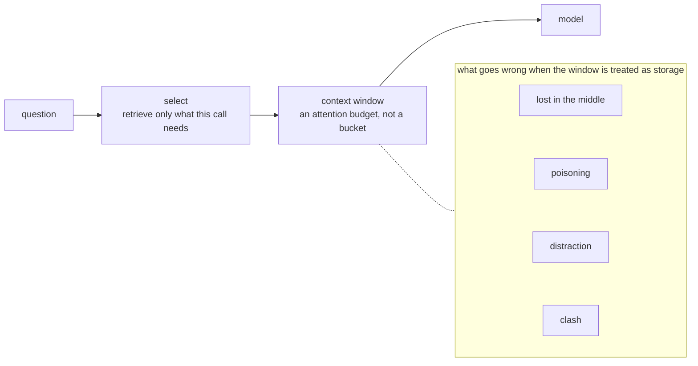
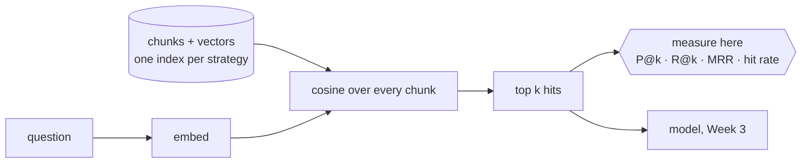

# Week 2 — Concept

> **The context window is an attention budget, not a storage limit. Retrieval decides what
> spends it, and retrieval is where most candidates lose the offer.**

Read this once (about 20 minutes). Write the sentence in your own words in `reflections/week-2.md`,
Q1, before you touch code.

## Two ideas, one week

**Context engineering** is deciding what the model sees on each call. Everything you put in the
window competes for attention with everything else. More context is not more knowledge; past a
point it is more noise, more latency and more money for the same answer, and sometimes a worse
one. The named failure modes:

| Failure | What it looks like |
| --- | --- |
| Lost in the middle | A fact placed mid-context is missed more often than one at the start or end |
| Poisoning | A wrong or hostile passage in the context steers the answer |
| Distraction | Plausible but irrelevant passages pull the answer off the question |
| Clash | Two passages disagree and the model picks one silently |

The disciplines that follow: **select** (only what this call needs), **compress** (summarise
what persists), **isolate** (keep tasks in separate contexts), **cache** (reuse a stable prefix
so you do not pay to re-read it), and be explicit about **memory**: what persists between turns
and sessions, and what must not.

**Retrieval** is how you select. Cut the corpus into chunks, embed them, find the nearest to the
question, hand those to the model. Every choice in that sentence is a measurable decision:

- **Chunking.** Fixed-size splits cut tables and sentences in half. Sentence and paragraph splits
  keep meaning whole but vary in size. Heading-aware splits keep a section's title with its body.
  Which is right depends on the documents and the questions, so you measure.
- **Embeddings and the store.** Chosen with a stated reason, not a default. This repo starts with
  a lexical embedder (`hash`) so you can see the mechanics, and a real one (`fastembed`) so you can
  see the difference.
- **Hybrid search and reranking.** Lexical and semantic search fail differently; combining them
  and re-scoring the top few usually beats either alone. That is a Core/Pro exercise here.
- **Evaluating retrieval separately from generation.** If the right chunk was never retrieved, the
  best model in the world cannot answer. So measure retrieval on its own, with its own metrics:
  precision at k, recall at k, mean reciprocal rank, and whether the context was relevant at all.

The same clause, cut four ways. Only one strategy keeps "3. Fees." with its fee.

Where the measurement sits: before the model, so a wrong answer can be traced to the step
that produced it.

## What this looks like in the service

| Idea | Where it lives | What you do this week |
| --- | --- | --- |
| Chunking | `app/retrieval/chunkers.py` | Compare four strategies with numbers; build the heading-aware one |
| Embedding | `app/retrieval/embed.py` | Switch `EMBED_PROVIDER` and see what changes |
| Store and search | `app/retrieval/store.py`, `/index`, `/search` | Read it; it is the interface a vector database would sit behind |
| Metrics | `app/retrieval/metrics.py` | Build precision@k, recall@k, MRR, hit rate |
| Attention budget | `explore/w2_02_lost_in_the_middle.py` | Bury one fact, watch cost and accuracy move |

## What you should be able to say by Friday

- Which chunking strategy you chose for this corpus, and the number that decided it.
- Why recall@k and precision@k can move in opposite directions when you change chunk size.
- What lost-in-the-middle is, and whether you saw it at the context sizes you tried.
- Why measuring retrieval separately from the answer is the only way to know where a wrong
  answer came from.

## Read more

Checked September 2026.

- [Lost in the Middle: How Language Models Use Long Contexts](https://arxiv.org/abs/2307.03172) (Liu et al., 2023) — the paper that named the failure. Read the figures; then re-run `explore/w2_02_lost_in_the_middle.py` with `--filler 200`.
- [Anthropic: Effective context engineering for AI agents](https://www.anthropic.com/engineering/effective-context-engineering-for-ai-agents) — select, compress, isolate, as a discipline rather than a trick.
- [Retrieval-Augmented Generation for Knowledge-Intensive NLP Tasks](https://arxiv.org/abs/2005.11401) (Lewis et al., 2020) — where the term RAG comes from; the architecture is what `/search` plus Week 3's `/ask` reproduce in miniature.
- [Pinecone: Chunking strategies](https://www.pinecone.io/learn/chunking-strategies/) — a practical survey of the choices in `chunkers.py` and a few this repo leaves to you.
- [Reciprocal Rank Fusion](https://plg.uwaterloo.ca/~gvcormac/cormacksigir09-rrf.pdf) (Cormack et al., 2009) — two pages; the hybrid-search method the `core` route uses.
- [BAAI/bge-small-en-v1.5](https://huggingface.co/BAAI/bge-small-en-v1.5) — the embedding model behind `EMBED_PROVIDER=fastembed`: what it was trained on, and what its similarity scores mean.
