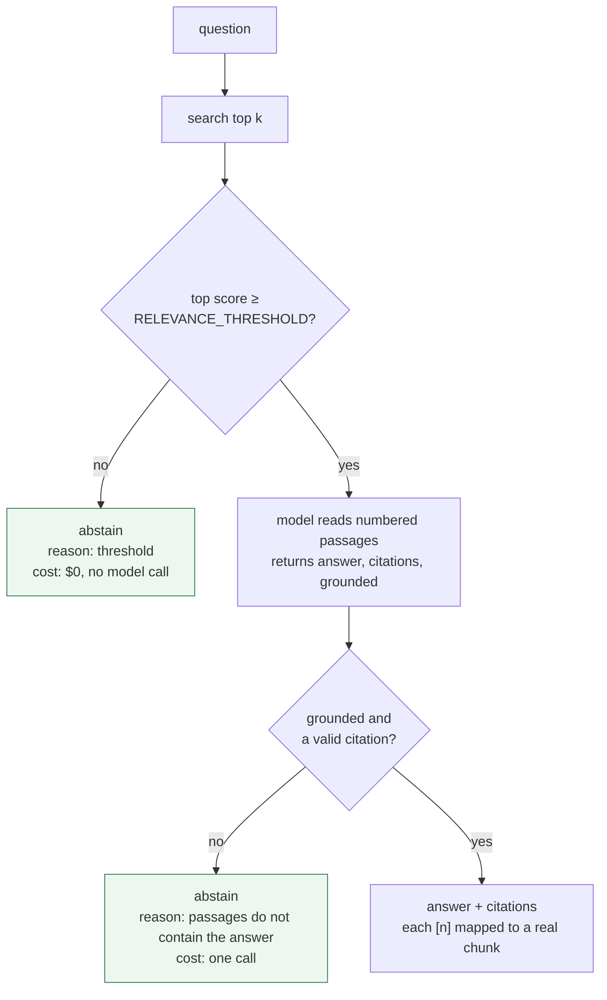
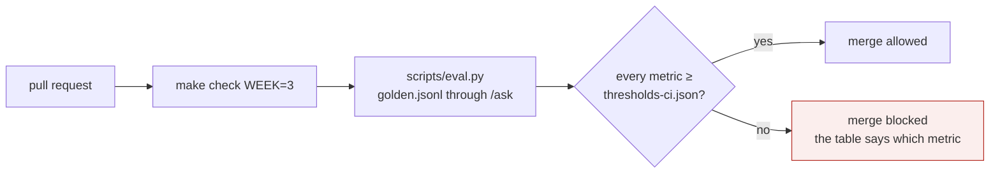

# Week 3 — Concept

> **A system that always answers is worse than one that sometimes declines. And nothing ships
> without a number that says how often it does each.**

Read this once (about 20 minutes). Write the sentence in your own words in `reflections/week-3.md`,
Q1, before you touch code.

## Grounding: answer from the passages or not at all

A model will answer any question you put to it. That is the problem. Grounding is the set of
disciplines that make it answer only from what you gave it:

- **Instruct** it to use only the retrieved passages. Necessary; never sufficient.
- **Threshold** retrieval. If nothing scored above a line, do not call the model at all. This
  saves money and, more importantly, removes the chance to invent.
- **Let it decline.** Give the model a structured way to say "the passages do not answer this"
  (`grounded: false`) and treat that as a first-class, expected outcome, not an error.
- **Cite.** Every answer names the passage it came from, so a reader (and a test) can check it.
- **Test abstention.** Deliberately ask questions the corpus cannot answer, and count how often
  the system invents one anyway. Nobody tests this until it embarrasses them.

## Evaluation: the thing that separates builders from enthusiasts

Interviewers ask two questions: how do you know it works, and what did it do for the business.
Evaluation is the answer to the first.

- **A golden dataset**, typically 100 to 500 examples, built from real queries, with the
  expected outcome for each. This repo ships 42; you grow it.
- **Three to five task-specific metrics**, not generic ones. Here: abstention rate on
  unanswerable questions, answer rate on answerable ones, hit rate on the expected fact, and
  citation validity. Not "accuracy". Not "BLEU".
- **A model as judge**, when a string match is not enough. Useful, and biased: it rewards length,
  confidence and plausibility. Calibrate it against your own labels before you trust it.
- **In CI, blocking merges.** A versioned golden set and a threshold file. A pull request that
  drops a number below its line does not merge. That is what "we have evals" means.
- **Sampled from live traffic** after release, scored continuously, because the questions people
  actually ask drift away from the ones you wrote.

Four numbers, one grid. Each cell is a different thing going wrong.

| | answered | declined |
| --- | --- | --- |
| **answerable** | hit rate: did it contain the fact? citation validity: did it cite the right file? | answer rate drops → look at retrieval first |
| **unanswerable** | abstention rate drops → look at the prompt and gate 2 | correct |

And the gate in CI, which is what "we have evals" means:

## What this looks like in the service

| Idea | Where it lives | What you do this week |
| --- | --- | --- |
| Threshold and decline | `app/api/ask.py`, `RELEVANCE_THRESHOLD` | Build the two gates |
| Citations | `AskOut.citations` | Map the model's `[n]` to real chunk ids and files |
| Golden set | `eval/golden.jsonl` | Read it, then extend it from real queries |
| Metrics and gate | `scripts/eval.py`, `eval/thresholds.json` | Run it, read it, make CI block on it |
| Judge | `app/eval/judge.py` | Calibrate it against your own scores (core, pro) |

## What you should be able to say by Friday

- Your abstention rate on unanswerable questions, and what you did to raise it.
- Why an answer rate of 48 percent with a 100 percent hit rate points at retrieval, not the model.
- Which of your four metrics would move first if someone changed the prompt, and which if someone
  changed the chunker.
- What the judge got wrong when you compared it with your own labels.

## Read more

Checked September 2026.

- [Hamel Husain: Your AI product needs evals](https://hamel.dev/blog/posts/evals/) — the most practical account of building an evaluation from real failures. Read it before you extend the golden set.
- [Judging LLM-as-a-Judge with MT-Bench and Chatbot Arena](https://arxiv.org/abs/2306.05685) (Zheng et al., 2023) — where the known judge biases (position, verbosity, self-enhancement) were measured. `judge_v1.md` names them because of this paper.
- [Retrieval-Augmented Generation](https://arxiv.org/abs/2005.11401) (Lewis et al., 2020) — again, this time for the grounding argument: why the passages, not the parameters, should carry the facts.
- [Anthropic: Effective context engineering for AI agents](https://www.anthropic.com/engineering/effective-context-engineering-for-ai-agents) — the section on what to put in front of the model applies directly to how `/ask` numbers its passages.
