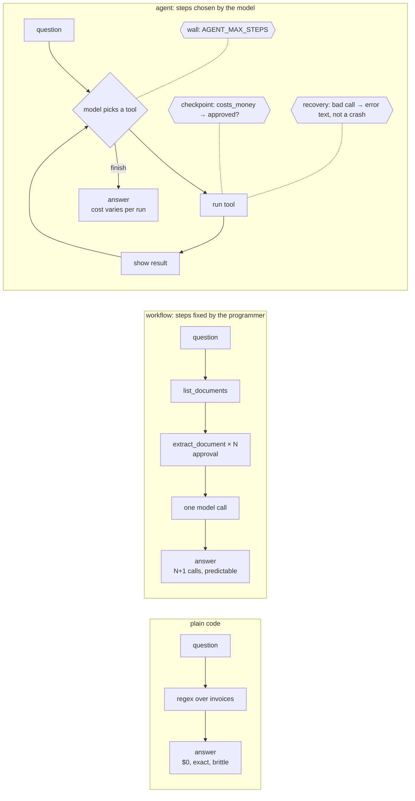
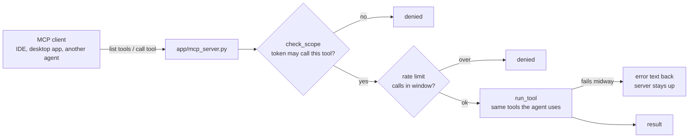

# Week 4 — Concept

> **Prefer the simplest thing that works. A workflow beats an agent when the steps are known;
> plain code beats both when the question is known. Multi-agent is a last resort.**

Read this once (about 20 minutes). Write the sentence in your own words in `reflections/week-4.md`,
Q1, before you touch code.

## Three ways to get an answer

| Way | Who decides the steps | Cost | Predictability | Handles a new question? |
| --- | --- | --- | --- | --- |
| Plain code | the programmer, in advance | zero | total | no: someone writes more code |
| Workflow | the programmer; the model fills in the reading | N+1 calls, fixed | high | only if the steps still fit |
| Agent | the model, as it goes | varies per run | low | yes, sometimes, at a price |

An agent is a loop: the model picks a tool, you run it, you show the model the result, it picks
again. That loop needs four things or it will hurt you:

- **Tool definitions with schemas** the model can use reliably, and validation on your side, so a
  malformed call becomes an error message the model reads, not an exception in your service.
- **A wall.** A maximum number of steps. Without it a confused agent runs until your budget is gone.
- **A human checkpoint on anything that costs money or cannot be undone.** A tool marked
  `costs_money` does not run until someone approved that spend.
- **A way to stop.** The `finish` tool is the only exit; everything else is a step.

The named patterns are mostly variations on where the deciding happens: *reason and act* (the
loop above), *plan then execute* (decide all steps first, then run them), *evaluator and
optimiser* (one model produces, another grades), *orchestrator and workers* (one model delegates
to others). Every one of them costs more and predicts less than the loop it replaces. Reach for
them when a measurement, not a diagram, says the simpler thing failed.

## Connecting to real systems

The Model Context Protocol is how a model client (an IDE, a desktop app, another agent) discovers
and calls your tools without you writing a client for each. It is a transport and a schema
convention. It is **not** a permission system. The moment an internal system is behind an MCP
server, three questions matter more than the protocol:

- **Who is calling, and what may they call?** A token gets the minimum set of tools its job needs
  (least agency). A reader cannot spend money.
- **How often?** Rate limits, per token.
- **What happens when a tool fails halfway?** The server answers with an error, stays up, and the
  client decides what to do. It never half-completes a write and says nothing.

This is the point where an AI feature becomes an infrastructure risk, and where a junior can do
real damage without intending to.

## What this looks like in the service

| Idea | Where it lives | What you do this week |
| --- | --- | --- |
| Tools and schemas | `app/agents/tools.py` | Read the validation path; add one tool on `core` |
| Plain code | `app/agents/plain.py` | Run it; note what it cannot do |
| Workflow | `app/agents/workflow.py` | Run it; count the calls |
| Agent loop | `app/agents/agent.py` | Build it: the wall, the checkpoint, recovery |
| Comparison | `scripts/compare_week4.py` | Cost per correct answer, per way |
| MCP server and scopes | `app/mcp_server.py`, `app/mcp_scopes.py` | Expose it; try to break your own permissions |

## What you should be able to say by Friday

- For the six tasks in `eval/tasks.jsonl`, which way you would ship and the two numbers that decided it.
- What your agent did on the question it got wrong, step by step, and what wall or checkpoint caught it.
- Why `extract_document` needs approval and `search_documents` does not.
- What a `reader` token can and cannot do through your MCP server, and how you proved it.

## Read more

Checked September 2026.

- [Anthropic: Building effective agents](https://www.anthropic.com/research/building-effective-agents) — the clearest statement of "workflows before agents", with the named patterns this week lists. Read it first.
- [ReAct: Synergizing Reasoning and Acting in Language Models](https://arxiv.org/abs/2210.03629) (Yao et al., 2022) — the loop in `agent.py` is this paper's idea; [a short explainer](https://www.promptingguide.ai/techniques/react) if the paper is heavy going.
- [Model Context Protocol](https://modelcontextprotocol.io/) — the specification and its examples; and the [Python SDK](https://github.com/modelcontextprotocol/python-sdk) that `mcp_server.py` is built on (note the 2.x rename from FastMCP to MCPServer: providers change under you here too).
- [OWASP Top 10 for LLM Applications](https://owasp.org/www-project-top-10-for-large-language-model-applications/) — read "Excessive Agency" this week; the rest is Week 5.
