# Week 6 — Concept

> **Interviewers ask what the last AI feature did for the business, not what it scored. A
> candidate who can only give a score has been building in a sandbox.**

Read this once (about 15 minutes). Write the sentence in your own words in `reflections/week-6.md`,
Q1. This week has less code and more proof.

## Shipping a system that is not deterministic

A normal deployment is checked by tests that either pass or fail. This one answers differently on
different days, and its provider changes under it. So the disciplines shift:

- **Versioning that includes the prompt and the model.** The same commit with a different model
  is a different system. `/health` says which build, which prompts, which provider.
- **A smoke test after every deploy**, and after every rollback. Not the whole evaluation: the
  four cheapest checks that prove the thing is up, is the version you meant, answers, and declines.
- **Rollback as a first-class action.** Deploy an earlier tag, on purpose, in a minute, and
  prove with the smoke test that it took. If you have never done it, you cannot do it at 3 a.m.
- **Watching it after release.** Traces from live traffic, sampled and scored, because the
  questions people ask drift away from the golden set you wrote.

```mermaid
flowchart LR
  T1[tag v1.0.0] --> D1[deploy] --> S1["smoke ✓<br/>expect-sha matches"]
  S1 --> BR["break on purpose<br/>RELEVANCE_THRESHOLD=1.5"] --> D2[deploy] --> S2["smoke ✗<br/>ask declines everything"]
  S2 --> RB["rollback<br/>Run workflow, ref = v1.0.0"] --> S3["smoke ✓<br/>minutes: ___"]
  S3 --> FX[fix forward] --> T2[tag v1.0.1] --> D3[deploy] --> S4[smoke ✓]
  style S2 fill:#fbeeed,stroke:#b3261e
  style S1 fill:#eef7ef,stroke:#2e7d4f
  style S3 fill:#eef7ef,stroke:#2e7d4f
  style S4 fill:#eef7ef,stroke:#2e7d4f
```

## Proving it: the write-up and the portfolio

The document says it plainly: interviewers ask what the feature did for the business. So:

- **The write-up** names the problem, what shipped, and what it does now, with numbers from your
  own evaluation, trace report and attack set, and then what it would cost at scale and what
  you chose not to build. Its most trusted section is "what went wrong on the way".
- **The portfolio project**: a real corpus, real numbers, a public repository with green CI, a
  live URL, and six reflections that show how you got there. That is what this repo has become.
- **The interview shape**: a software round with retrieval, agent and evaluation design layered
  on. Your defence at the end of this week is that round.

## What this looks like in the service

| Idea | Where it lives | What you do this week |
| --- | --- | --- |
| Build identity | `app/build_info.py`, `/health` | Tag, deploy, read it back from the live URL |
| Smoke test | `scripts/smoke.py`, the deploy workflow | Run it after your deploy and your rollback |
| Rollback | `deploy.yml`, `workflow_dispatch` with a ref | Break it on purpose, roll back, prove it |
| Write-up | `weeks/6/WRITEUP_TEMPLATE.md` | One page, numbers not adjectives |
| Defence | your mentor's final session | The whole track, defended |

## What you should be able to say by Friday

- Which tag is live right now and how you know without opening a shell.
- What a rollback took, in minutes, and what the smoke test said before and after.
- What the feature does for the business, in one sentence with a number in it.
- What you would change before 10,000 documents a day, and what it would cost.

## Read more

Checked September 2026.

- [Google SRE book: Release engineering](https://sre.google/sre-book/release-engineering/) — why a rollback you have never run is not a rollback.
- [GitHub Docs: manually running a workflow](https://docs.github.com/en/actions/managing-workflow-runs/manually-running-a-workflow) — the `workflow_dispatch` mechanism your rollback uses.
- [Hugging Face: Docker Spaces](https://huggingface.co/docs/hub/spaces-sdks-docker) — what the deploy workflow pushes to, and the constraints (port 7860, user 1000, sleeping).
- [Hamel Husain: Your AI product needs evals](https://hamel.dev/blog/posts/evals/) — the last section, on what to say to stakeholders, is a good model for the write-up.
